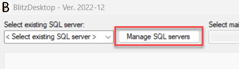
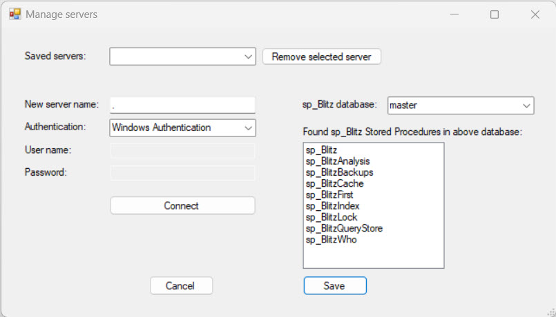
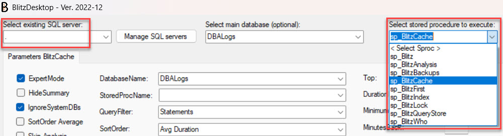
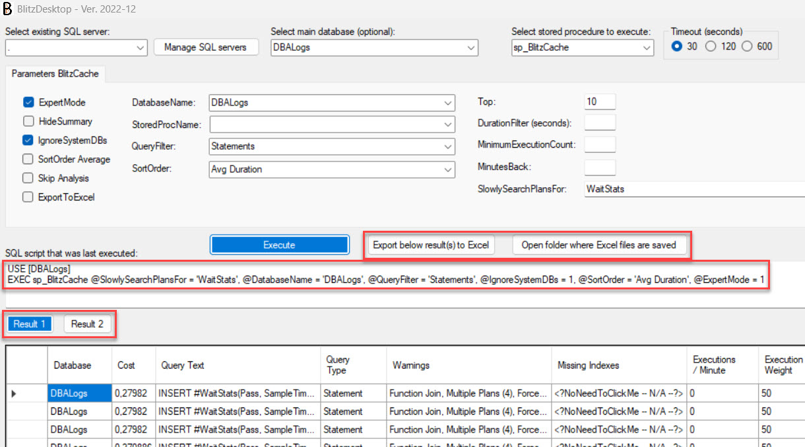
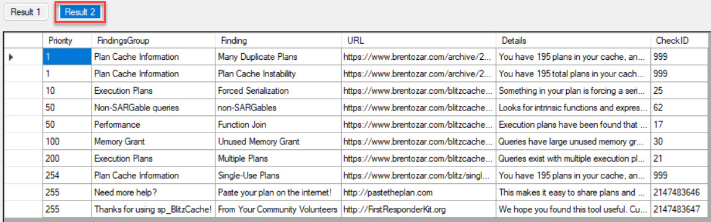
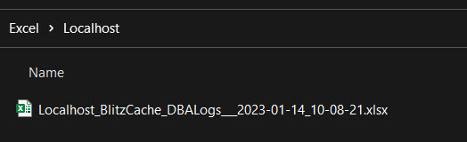
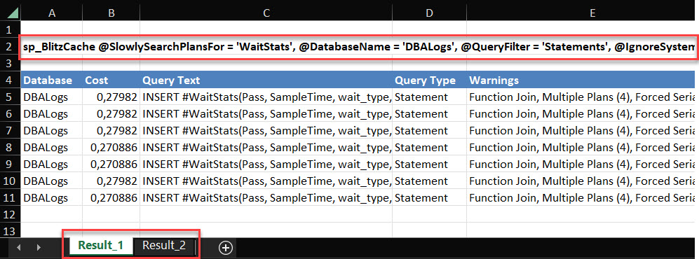
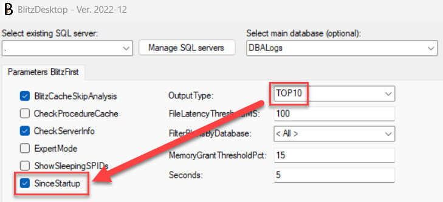

# BlitzDesktop

BlitzDesktop will make you able to run the sp_Blitz* stored procedures (provided by Brent Ozar Unlimited) on your desktop in this Win Forms applikation.

## Benefits:
-	You don’t have to remember all the arguments.
-	You can save the output to disk in Excel files. These are named by server, stored procedure and date so you will have history saved.

## Prerequisites:
-	You need to have the sp_Blitz* stored procedures installed on your SQL server(s). The stored procedures can be found at https://www.brentozar.com/first-aid/.

## Preknowledge:
-	You should be familiar with the sp_Blitz* stored procedures known as the First Responder Kit by Brent Ozar.

## Support:
If you need help with this application file an issue.
Support for the sp_Blitz* stored procedures are handled by Brent Ozar Unlimited at https://www.brentozar.com/support/.

Supported stored procedures:
- sp_Blitz
- sp_BlitzAnalysis
- sp_BlitzBackups
- sp_BlitzCache
- sp_BlitzFirst
- sp_BlitzIndex
- sp_BlitzLock
- sp_BlitzQueryStore
- sp_BlitzWho

1.
Install the application found in the Releases section on the right hand side.

2.
Add the server(s) you want to monitor. These will be saved so you can easily just select from a dropdown next time you run the application.

3.
Select the server you want to query and then select the stored procedure you want to run and possible select arguments you want to run it with.
Then click on [Execute].

You will get the statement that was executed in case you want to run the same query from within SSMS.
Each result set is displayed in its own grid.

You have a button to save the output to Excel and if you should forget where these Excel files are saved you can click another button which will open the folder where your Excel files are saved.

Each result set is saved in its own tab here as well along with the statement executed.

## Disclaimer:
I have tried to mimic the logic that is found within some of the stored procedures to some extent but not all logic that may be found in the stored procedures may be available in this application.

Example on logic that do exist:
If you for sp_BlitzFirst select [OutputType] = TOP10 the flag [SinceStartup] will automatically be set in the stored procedure. This will also happen in the application. 
And should you uncheck [SinceStartup] it will automatically be set when you click on [Execute].

Not all arguments available in the stored procedures may be available from within BlitzDesktop.

 
